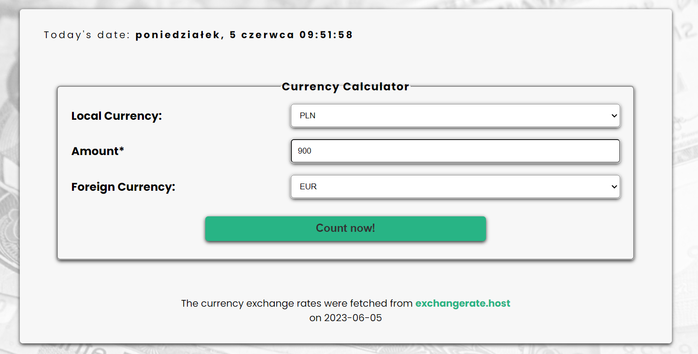

# 💰Currency Calculator

Currency Calculator is a web application built using **React, TypeScript, React Query, React Router and SCSS.** It allows users to convert their local currency to any other currency based on the exchange rate obtained from the **[Exchangerate API](https://exchangerate.host/#/)**. The application also includes **custom hooks** for handling data fetching and manipulation.

This project was bootstrapped with [Create React App](https://github.com/facebook/create-react-app).

## 🔎Demo

[Currency Calculator - see it now!](https://maxnatalia.github.io/currency-calculator-ts/)

### Preview

### Preview with Result

## 📌Usage

- Select your local currency.
- Enter the amount in your local currency that you want to convert.
- Choose the target currency (foreign currency).
- The converted amount will be displayed automatically in the Result window.

## 📌Features

- Convert local currency to any other currency using the exchange rate💵
- Utilizes React for building the user interface
- Written in **TypeScript** for enhanced type safety
- Implements **React Query** for efficient data fetching and caching
- Styling done using **SCSS** for flexible and maintainable styles
- Responsive Web Design🖥️📱
- Fetches currency exchange rates from the **[Exchangerate API](https://exchangerate.host/#/)**
- Allows users to select their local currency💶
- About page providing information about the author and the history of the application - using **React Router**
- **Loading indicators** for a smooth user experience
- **Error handling** for handling unexpected issues

## 📌About

The Currency Calculator application was developed as a personal project to demonstrate the use of **React, TypeScript, React Query, React Router and SCSS** in building a currency conversion application.

The project's aim was to provide a simple and user-friendly interface for converting currencies using live exchange rates.

## 🛠️Available Scripts

In the project directory, you can run:

### `npm start`

Runs the app in the development mode.\
Open [http://localhost:3000](http://localhost:3000) to view it in the browser.

The page will reload if you make edits.\
You will also see any lint errors in the console.

### `npm run build`

Builds the app for production to the `build` folder.\
It correctly bundles React in production mode and optimizes the build for the best performance.

The build is minified and the filenames include the hashes.\
Your app is ready to be deployed!

See the section about [deployment](https://facebook.github.io/create-react-app/docs/deployment) for more information.

### `npm run eject`

**Note: this is a one-way operation. Once you `eject`, you can’t go back!**

If you aren’t satisfied with the build tool and configuration choices, you can `eject` at any time. This command will remove the single build dependency from your project.

Instead, it will copy all the configuration files and the transitive dependencies (webpack, Babel, ESLint, etc) right into your project so you have full control over them. All of the commands except `eject` will still work, but they will point to the copied scripts so you can tweak them. At this point you’re on your own.

You don’t have to ever use `eject`. The curated feature set is suitable for small and middle deployments, and you shouldn’t feel obligated to use this feature. However we understand that this tool wouldn’t be useful if you couldn’t customize it when you are ready for it.
